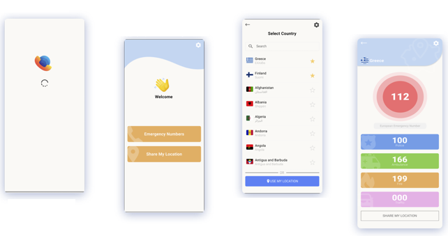
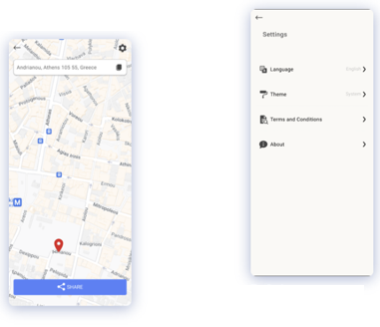

# GlobalHelp - Emergency Numbers and Location Sharing App
This is a group project made for a university course.

GlobalHelp is a Flutter app that provides quick access to emergency numbers worldwide and allows users to easily share their location during emergencies. It supports both dark and light modes, and offers English and Greek language options.

## Features

* Emergency Numbers: Access emergency contacts globally via the Emergency Number API.
* Location Sharing: Instantly share your location in emergencies.
* Theme Support: Toggle between dark and light modes.
* Localization: Available in English and Greek.

   

 

  

  

